# Deploying Azure Render Hub

Deploying the Azure Render Hub requires the following steps:

* Create an Azure Active Directory (AAD) Application (used for authentication and to control access)
* Deploying the hub from our Github Repo

You can create the AAD application either using the Azure Portal, or using the [Azure Cloud Shell](#create-an-azure-ad-application-using-cloud-shell). Both approaches are described below.

## Create an Azure AD Application using the Azure Portal

The Azure portal is constantly being improved, so the screenshots below might not exactly match what you see.

The AAD application is used by Render Hub to authenticate the user and request consent for the portal to access Azure resources as the user.  Creating the AAD application via the Azure portal will enable the application as an 'Enterprise Application' which means you can restrict portal access to specific users.  This is recommended, otherwise all users in your AAD organization will have access to the portal.

Delegated permissions are used to access Azure resources on behalf of the logged in user.  Successfully logging into the hub does not guarantee that a user will have access to read or create Azure resources within the Azure Subscription.

The user deploying the Render Hub portal and setting up the first environment should ideally have Subscription Administrator or Owner permissions as they will need to have the rights to create resources and assign permissions.

### Using the Azure Portal

Login to the Azure portal and select the Azure Active Directory application registration blade, or click [here](https://portal.azure.com/#blade/Microsoft_AAD_IAM/ActiveDirectoryMenuBlade/RegisteredApps).

If you don't have *Azure Active Directory* listed in your sidebar, select *All Services* and search for it.

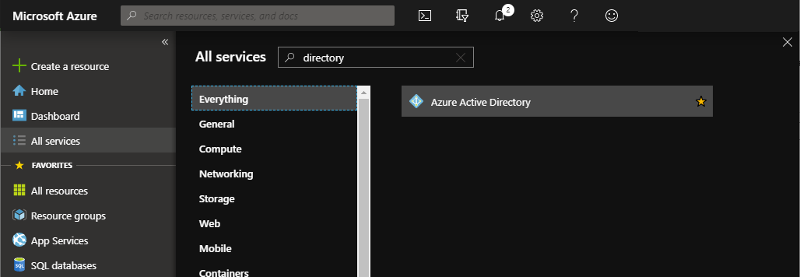

Once open, select the *App registrations* page from the sidebar.

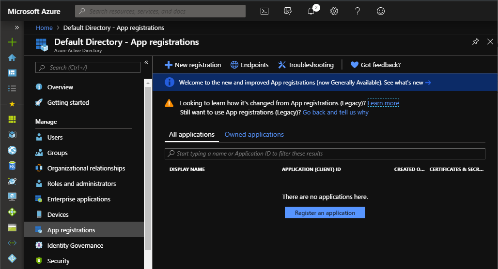

#### Create the AAD Application

We're going to create the AAD application required to host the Azure Render Hub in your subscription. This includes limiting who will be able to access your hub and specifying the URL where your hub will be published.

 1. Press *New registration*
 2. Enter an application name, e.g. `AzureRenderHub`

    - This name will be used as the name for your website, so it needs to be 60 characters or shorter.

 3. Under *Supported Account Types*, the default value ("Accounts in this organizational directory only*) should be correct.
 4. For application type select `Web`
 5. Enter *Redirect URI* - this is the URL of the Web App that you will deploy next.

    - The URL will be in the format, https://[MyWebAppName].azurewebsites.net.
    - The name is globally unique, and you will not be able to use a name that has already been used by someone else.

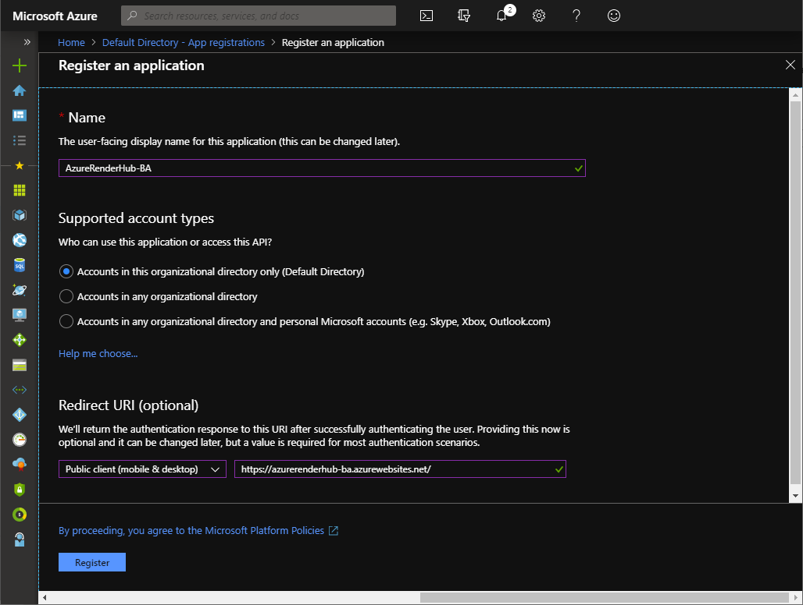

 6. Click *Register*
 7. Note the Application ID as you'll need it later

#### Enable ID Tokens

We need to ensure that *ID tokens* are enabled for the AAD application.

1. From the sidebar, select *Authentication*
2. Scroll down to *Advanced settings*

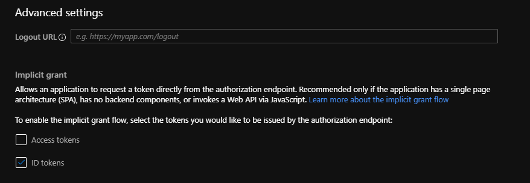

3. Ensure *ID tokens* is checked

#### Assign API Access Permissions

We need to configure your newly created AAD application with access to user profile information. By default, a new application has access to nothing at all.

The following permissions are required for the following reasons.

Microsoft Graph
- User.Read - Read the currently logged in users email and Object Id
- User.ReadBasic.All - (Optional) Read basic user information from the directory - this is used to resolve Object Ids -> email addresses on the User Permissions page and is optional.

Azure Service Management
- user_impersonation - Allow access to ARM resources and APIs as the logged in user.

1. From the sidebar, select *API permissions*

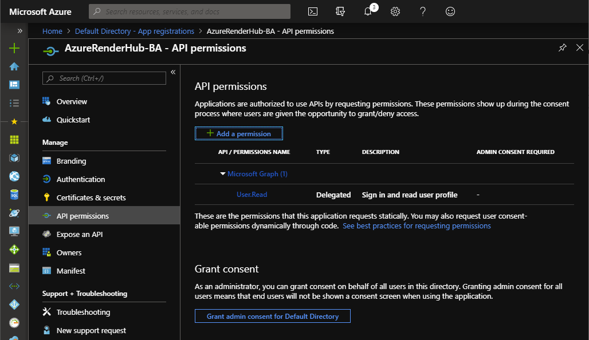

2. Press *Add a permission*
3. From the *Select an API* pane, select *Microsoft Graph*

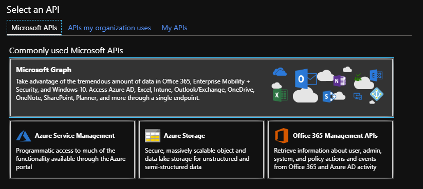

4. Press "Delegated Permissions*
5. Select the following permissions, found under the **User** heading (near the bottom)

 - User.Read - 'Sign in and read user profile'
 - User.ReadBasic.All - 'Read all users' basic profiles'

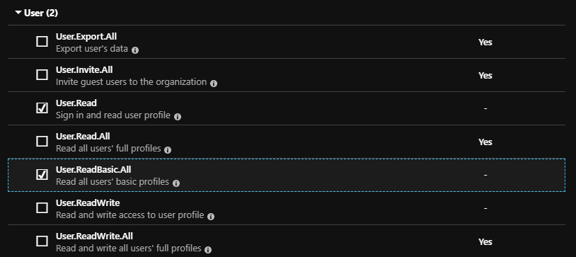

6. Press "Add permissions" to save your changes

7. Repeat the process (starting with "Add a permission"), selecting *Azure Service Management*, choosing "Delegated Permissions", and adding the `user_impersonation` permission.

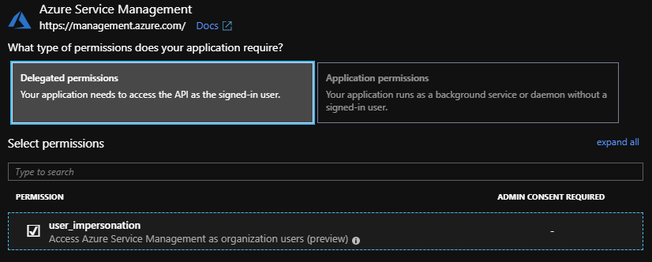

8. Press "Add permissions" to save.

When complete, you should have these permissions configured:

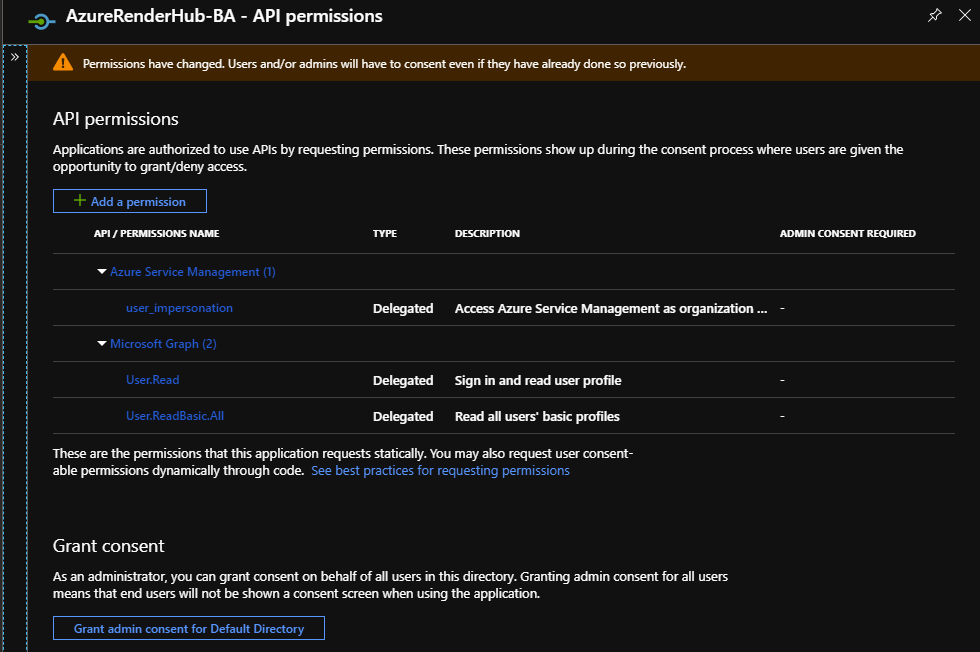

If prompted, press *Grand admin consent* to activate these changes. If you don't have rights to grant this permission, contact one of your subscription administrators.

#### Create a Client Key (Secret)

We need to create a client key that will be used by the Azure Render Hub to authenticate with AAD.

 1. On the Portal page for your App Registration, *click Certificates & Secrets*  
    (if you are using App Registrations (Legacy) then it will be under the *Settings* page, and named *Keys*).

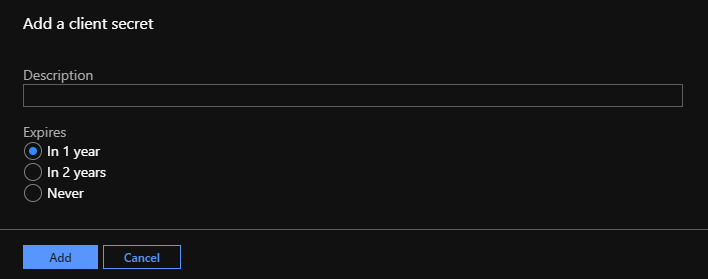

 2. Under Client Secrets, press *New client secret*, enter a description in the blank box, select "Never" for an expiry and click *Add*  
    (with App Registrations (Legacy) this will be called "Passwords").
 3. **Important**: Save the displayed Value somewhere safe, you will need it later on. The key cannot be accessed again once you leave this page.

Note: Once you navigate away from this screen, the key cannot be accessed again. If you lose the secret, you'll need to return here and create a new one.

#### Update the Redirect URI

We should check the Redirect URI configured for the application is correct - it must end with `/signin-oidc`.

 1. Select *Authentication* from the sidebar
 2. If needed, modify the existing reply URL to append '/signin-oidc'
    
    - The new URL should look like:  
    `https://[MyWebAppName].azurewebsites.net/signin-oidc`

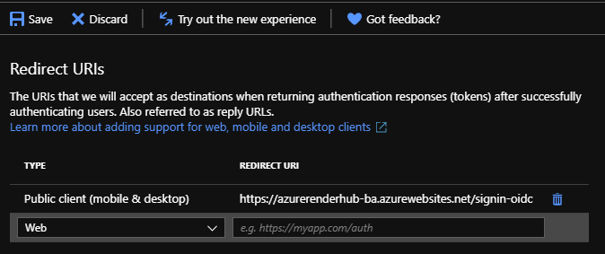

 3. Press *Save* 

#### Get the AAD Tenant ID

In the Azure Portal navigate to *Azure Active Directory* -> *Properties*.

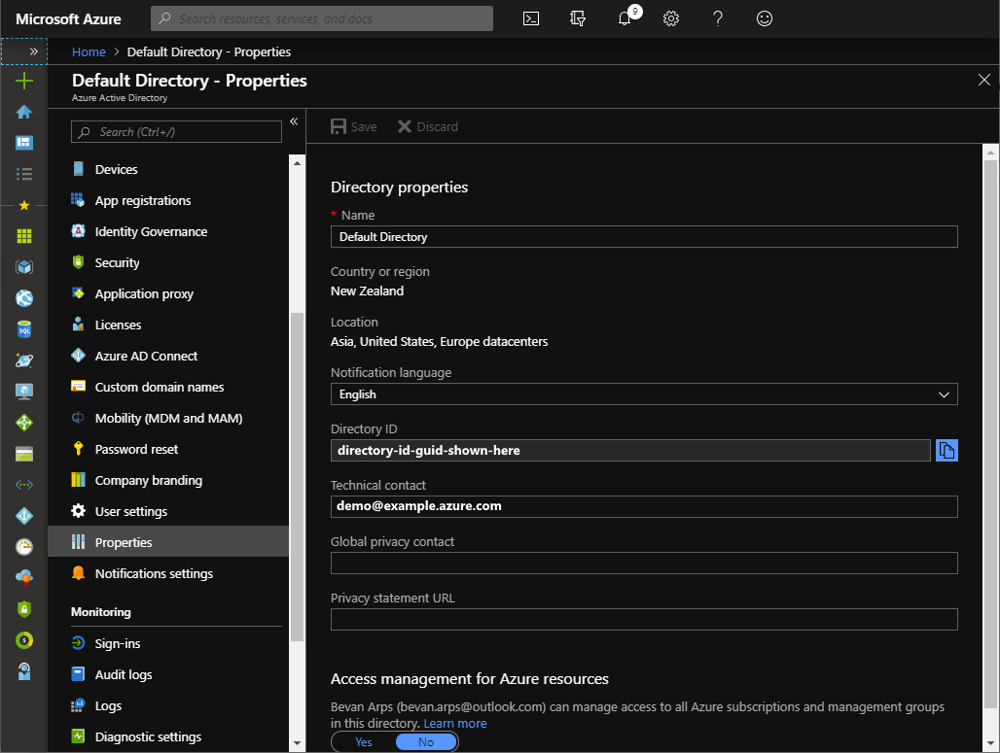

Note down the *Directory ID*, this is your "Tenant ID" that will be required when you deploy the portal.

### Create an Azure AD Application using Cloud Shell 

*You don't need to do this if you've used the steps above to create the AAD application using the portal.*

You can create the application via the Azure Cloud Shell [here](https://shell.azure.com/powershell).  After opening Cloud Shell ensure that it is set to the 'Powershell' environment.

Copy the script snippet shown below, update the `$webAppName` variable, and paste the script below into the cloud shell to create a new AAD application.

Keep in mind the Web App name must be globally unique, and must be a valid DNS name as it becomes the host in your website's URL, e.g. `https://<webAppName>.azurewebsites.net`.  The $webAppName value must match the webSiteName that you provide when you deploy the Render Hub portal.

```
$webAppName = "MyAzureRenderHub"

# Create the application
$app = az ad app create --display-name $webAppName --identifier-uris http://$webAppName --end-date 2040-12-31 --homepage "https://${webAppName}.azurewebsites.net" --reply-urls "https://${webAppName}.azurewebsites.net/signin-oidc"

# Register the Service Principal in the current directory
az ad sp create --id ($app | ConvertFrom-Json).appId

# Assign the required API permissions

# Windows Azure Active Directory - Sign in and read user profile
az ad app permission add --id ($app | ConvertFrom-Json).appId --api 00000002-0000-0000-c000-000000000000 --api-permissions 311a71cc-e848-46a1-bdf8-97ff7156d8e6=Scope
az ad app permission grant --id ($app | ConvertFrom-Json).appId --api 00000002-0000-0000-c000-000000000000

# Graph API - Sign in and read user profile
az ad app permission add --id ($app | ConvertFrom-Json).appId --api 00000003-0000-0000-c000-000000000000 --api-permissions e1fe6dd8-ba31-4d61-89e7-88639da4683d=Scope
az ad app permission grant --id ($app | ConvertFrom-Json).appId --api 00000003-0000-0000-c000-000000000000

# Windows Azure Service Management API - Access Azure Service Management as organization users (preview)
az ad app permission add --id ($app | ConvertFrom-Json).appId --api 797f4846-ba00-4fd7-ba43-dac1f8f63013 --api-permissions 41094075-9dad-400e-a0bd-54e686782033=Scope
az ad app permission grant --id ($app | ConvertFrom-Json).appId --api 797f4846-ba00-4fd7-ba43-dac1f8f63013

# Print the app details to the shell
$app

```

## Assign Users and Groups to the Azure AD Application

It's good practice to limit access to the Azure AD application to restrict Render Hub access to those that need it.

The following instructions allow you to restrict access to specific users or groups in your organization.

 1. In the Azure portal navigate to *Azure Active Directory* -> *Enterprise Applications*
 2. Search for the AAD Application you created above using the Application ID noted earlier

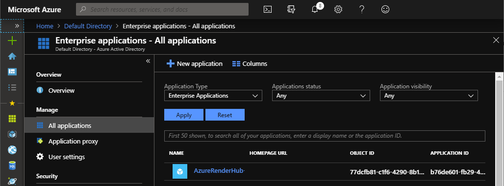

 3. Press the name of the application to open it
 4. Select on *Properties* and turn on *User Assignment Required*

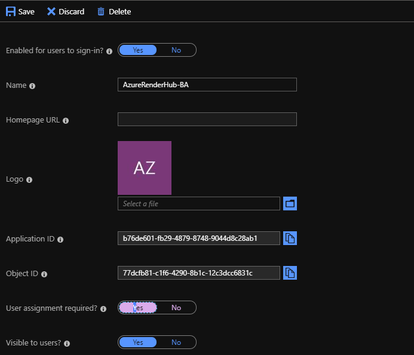

 5. Press *Save*


 6. Select *Users and Groups* from the sidebar
 7. Add each user or group that requires access to the portal

When you are finished, all the users with access to your Azure Render Hub will be listed.

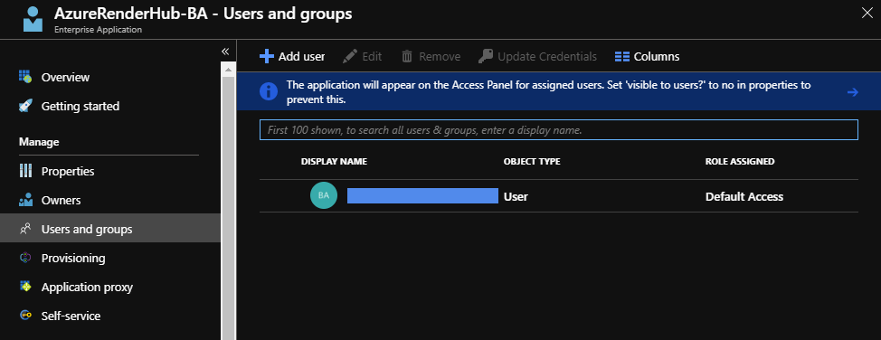

## Deploying the Portal

Click the following link to start a deployment into your existing Azure subscription.  The required input fields are described in detail below.

<a href="https://portal.azure.com/#create/Microsoft.Template/uri/https%3A%2F%2Fraw.githubusercontent.com%2FAzure%2Fazure-render-hub%2Fmaster%2FTemplates%2FAzureRenderHub.json" target="_blank" rel="noopener">
   
</a>

 - `Resource Group`: The Azure resource group into which the Azure Render Hub will be deployed. We recommend using a new resource group to keep the hub isolated from your other assets.
 - `Web Site Name`: The Azure Web App name, which must match the name you used for the AAD Application above. This must be globally unique and is also part of the website's DNS name.
 - `Hosting Plan Name`: The name of the hosting plan service, you can leave the default.
 - `Sku`: The Hosting Plan tier that determines the performance and cost for the Web App.  Plans and prices are available [here](https://azure.microsoft.com/en-au/pricing/details/app-service/plans/).
 - `Aad Tenant Id` ("Directory ID"): the AAD application tenant ID from the application you created above. In the Azure Portal this can be found on the Properties page for the directory.
 - `Aad Domain`: the AAD tenant domain, e.g. `contoso.microsoft.com`. In the Azure Portal this is shown on the Overview pane for the directory, right at the top.
 - `Aad Client Id` ("Application ID"): the AAD application (or client) ID you noted when you created the AAD application.
 - `Aad Client Secret` ("Password"): the AAD application/client secret from above.

Accept the terms and conditions for the marketplace, then press *Purchase*.

Note that the Azure Render Hub is provided at no charge, however you will be charged for the virtual machines (etc) used to run the hub.

\* Note that auto scale functionality requires the web site to always be running which requires Basic/B1 SKU or higher.
 
After submitting the deployment your instance of the Portal will be deployed into your subscription.  You'll see a link to the deployment to monitor its progress.

## Accessing the Portal


Once the deployment is complete you can access the portal at: `https://[webSiteName].azurewebsites.net`

To continue setting up Render Hub see the docs [here](README.md).

## Troubleshooting

### HTTP Error 502.5 - ANCM Out-Of-Process Startup Failure

Causes are ...

Fixes are ...
