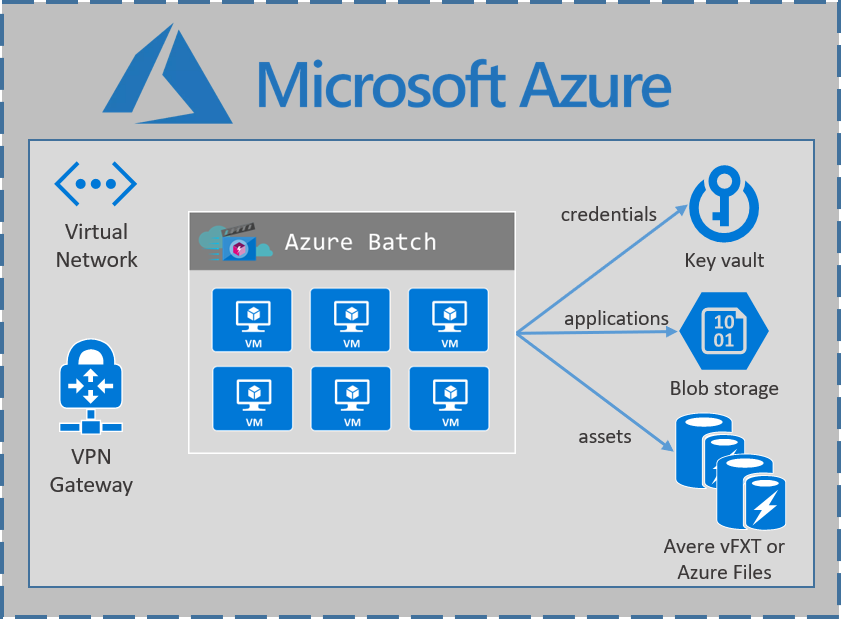

# Render Farm Environments

Environments are a core concept of the Render Farm Manager and encapsulate all the Azure resources required to deploy and 
maintain a render farm in Azure.

You can have a single environment, or multiple environments that could represent different
departments or cost centers in your organisation.  For you example, you could have an Environment for you studio in LA and another 
one for a studio in Vancouver.

An Environment consists of the following Azure resources.

**Azure VNet and Subnet**

This is the Virtual Network with connectivity to your Qube Supervisor or Deadline Repository.  It is also where all your 
virtual machines will be deployed to ensure they can connect to the Supervisor or Repository.

See [here]() for more information.

**Azure Batch Account**

Azure Batch deploys Virtual Machines at scale.  It allows you to create a single virtual machine, or 10s of thousands of virtual machines.
Azure Batch abstracts the complexities of managing many virtual machine deployments and images to acheive this scale.

For more information on Azure Batch see [here](https://azure.microsoft.com/en-au/services/batch/).

Azure Batch also enables Pay-Per-Use (PPU) licensing for your rendering applications, if required.

PPU Licensing currently supports:

Autodesk 3ds Max
Autodesk Maya
Chaos Group VRay
Autodesk Arnold

For more information on Azure Batch Rendering see [here](https://azure.microsoft.com/en-au/services/batch/rendering/).

**Azure Storage**

By default an Azure Files share is created and can be used for input and output data.  Qube and Deadline each have methods to automatically mount a 
share on the render nodes.  See the Environment -> Storage tab for details.

**Key Vault**

A Key Vault service is created for each environment to storage credentials such as domain credentials, database certificates (Deadline) and other sensitive information.

See [here](https://azure.microsoft.com/en-au/services/key-vault/) for more information.

**Application Insights**

The Render Farm Manager automatically installs the Application Insights agent on the render nodes to capture CPU, GPU and Rendering process metrics. 
This information is used to automatically scale down virtual machine pools as nodes become idle.

For more information see [here](https://docs.microsoft.com/en-us/azure/azure-monitor/app/app-insights-overview).
